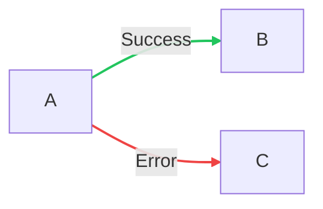
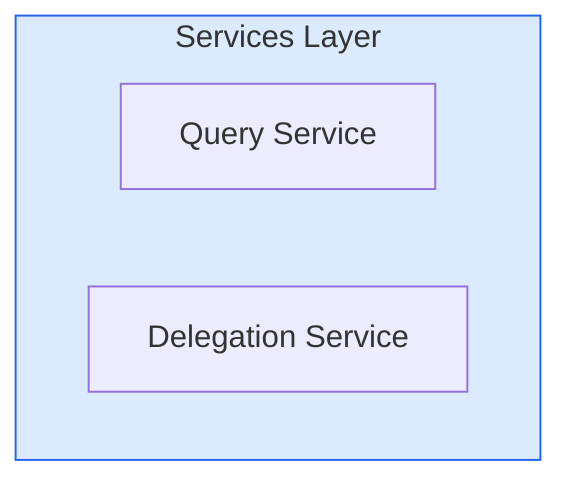

# Mermaid Color Palette

> **Standardized color palette for Agent CLI Orchestrator diagrams**

---

## Primary Colors

Use these colors for main elements and key components:

| Color Name | Hex Code | Usage |
|------------|----------|-------|
| Primary Blue | `#2563eb` | Main services, primary flows |
| Primary Green | `#16a34a` | Success states, completed actions |
| Primary Orange | `#ea580c` | Active processes, warnings |
| Primary Purple | `#9333ea` | Special components, MCP elements |

## Background Colors

Use these colors for backgrounds and containers:

| Color Name | Hex Code | Usage |
|------------|----------|-------|
| Light Blue | `#dbeafe` | Service backgrounds, information blocks |
| Light Green | `#dcfce7` | Success backgrounds, completed states |
| Light Orange | `#ffedd5` | Warning backgrounds, active states |
| Light Purple | `#f3e8ff` | Special backgrounds, MCP contexts |

## Neutral Colors

Use these colors for text, borders, and structural elements:

| Color Name | Hex Code | Usage |
|------------|----------|-------|
| Dark Gray | `#1f2937` | Primary text, important labels |
| Medium Gray | `#6b7280` | Secondary text, descriptions |
| Light Gray | `#f3f4f6` | Borders, dividers, backgrounds |
| White | `#ffffff` | Canvas, card backgrounds |

## Status Colors

Use these colors for status indicators and states:

| Color Name | Hex Code | Usage |
|------------|----------|-------|
| Success | `#22c55e` | Successful operations, completed tasks |
| Warning | `#eab308` | Warnings, pending actions |
| Error | `#ef4444` | Errors, failed operations |
| Info | `#3b82f6` | Information, neutral states |

---

## Usage Guidelines

### General Principles

1. **Consistency**: Use the same colors for similar concepts across all diagrams
2. **Contrast**: Ensure text is readable against backgrounds
3. **Hierarchy**: Use darker colors for more important elements
4. **Status**: Always use status colors for state indicators

### Specific Applications

#### Architecture Diagrams
- **Primary Blue**: Core services, main API
- **Primary Purple**: MCP server, special integrations
- **Primary Orange**: Active sessions, running processes
- **Primary Green**: Completed operations, successful flows

#### Flow Diagrams
- **Primary Blue**: Normal flow path
- **Primary Green**: Success path, completion
- **Primary Orange**: Decision points, branching
- **Error Red**: Error paths, failure states

#### State Diagrams
- **Success Green**: Final/completed states
- **Warning Yellow**: Transitional/pending states
- **Error Red**: Error/failed states
- **Info Blue**: Initial/active states

#### Sequence Diagrams
- **Primary Blue**: Client components
- **Primary Purple**: MCP components
- **Primary Orange**: Backend services
- **Primary Green**: External integrations

---

## Mermaid Syntax Examples

### Setting Node Colors

### Setting Edge Colors

### Setting Background Colors

---

## Color Accessibility

All color combinations in this palette meet WCAG 2.1 Level AA standards for:
- Normal text (4.5:1 contrast ratio)
- Large text (3:1 contrast ratio)
- UI components (3:1 contrast ratio)

---

*Version: 1.0*  
*Last Updated: January 2026*
